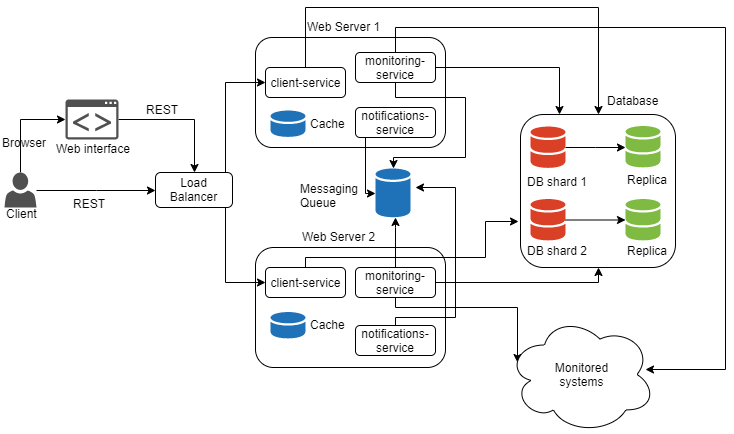

Watchdog
--

Watchdog is a monitoring tool to keep an eye on web sites /servers through different methods such as HTTP/HTTP(s) 
requests, ping and socket connections. It will monitor the configured sites/server and notify if they are down.
The application domain is service monitoring and health check. It is targeted to make the lives of people in operations 
easy. The individual developers that maintain several open-source/paid services on their own could also benefit from 
such a tool.

**Tech Used**
* React
* Spring boot
* Redis
* MongoDB
* CockroachDB
* ActiveMQ
* Docker
* Maven
* Nginx
